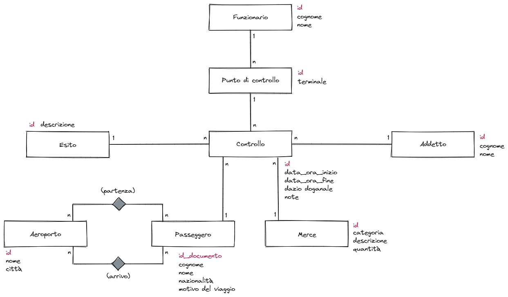

*Mercoledì, 06 aprile 2022*

# Esercizio

### Analisi e ipotesi

1. Si ipotizza che l'inserimento di un controllo sia effettuato da un solo addetto/funzionario.
2. L'attributo *categoria* dell'entità *Merce* può assumere i valori: generi alimentari, strumentazione elettronica, farmaci, abbigliamento, …
3. L'attributo *descrizione* dell'entità *Esito* può assumere i valori: nessuna segnalazione, merce respinta, fermo del passeggero, …
4. L'attributo *dazio doganale* dell'entità *Controllo* può assumere i valori: non dovuto / importo del dazio, se dovuto.
5. L'attributo *id* dell'entità *Passeggero* è il numero del passaporto o della carta di identità.
6. L'attributo *tipo* dell'entità *Controllo* può assumere i valori *passeggero* o *merce*.

### Modello concettuale

### Modello logico

- Aeroporto (<u>id</u>, nome, città)
- Esito (<u>id</u>, descrizione)
- Funzionario (<u>id</u>, cognome, nome)
- Addetto (<u>id</u>, cognome, nome)
- Passeggero (<u>id</u>, cognome, nome, nazionalita, motivo)
- partenza (<u>aeroporto_id</u>, <u>passeggero_id</u>, data_ora)
- arrivo (<u>aeroporto_id</u>, <u>passeggero_id</u>, data_ora)
- Merce (<u>id</u>, categoria, descrizione, quantita)
- Punto_Controllo (<u>id</u>, terminale, *funzionario_id*)
  - con v.i.r. di funzionario_id con Funzionario(id)
- Controllo (<u>id</u>, data_ora_inizio, data_ora_fine, dazio_doganale, note, tipo, *esito_id*, *punto_controllo_id*, *addetto_id*, *merce_id*, *passeggero_id*)
  - con i vari v.i.r.

### Modello fisico

### Interrogazioni SQL