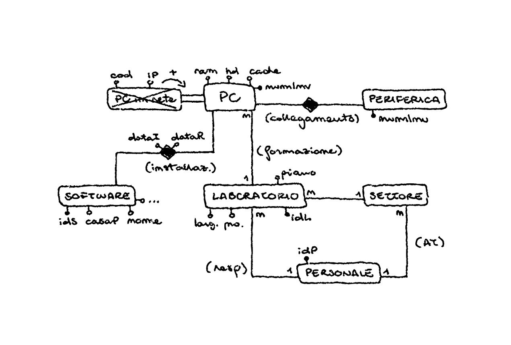
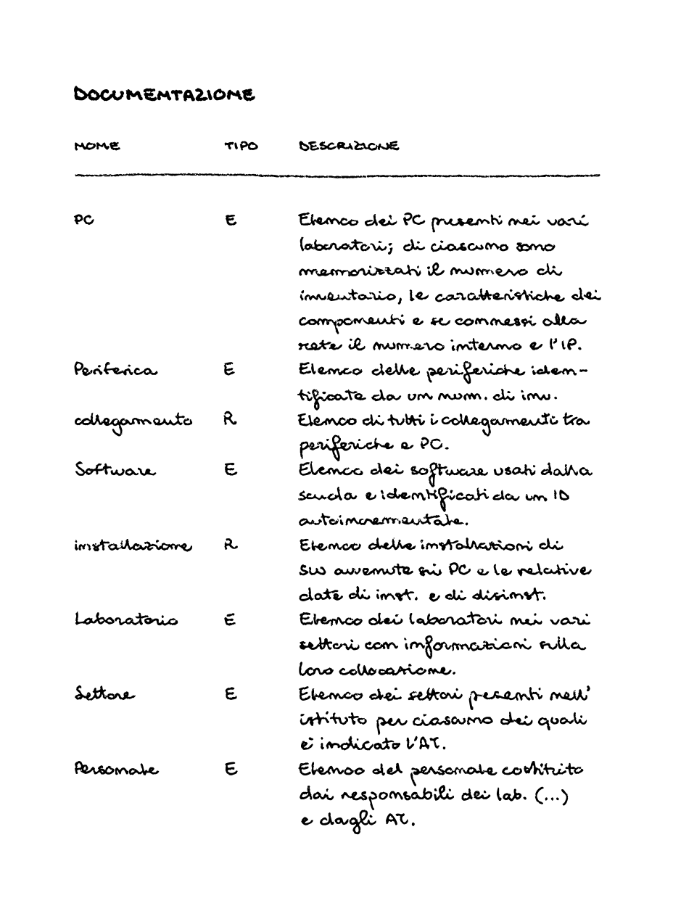

*Lunedì, 16 maggio 2022*

# Esercizio

**Gestione PC: configurazione hardware e installazioni software**

Il nostro Istituto desidera memorizzare i dati che riguardano la configurazione hardware dei diversi PC (circa 200) e del software su di essi installato. L’obiettivo è tenere sotto controllo la complessa situazione e di utilizzare le informazioni raccolte in sede di programmazione didattica, gestione delle aree di progetto, organizzazione di corsi, ..., per le quali è indispensabile conoscere quali strumenti hardware e software sono disponibili. 

> **Parte di laboratorio**  
> Per rendere accessibili a tutto il personale queste informazioni, si prevede di realizzare un’interfaccia web che permetta di consultare il database da qualunque PC in rete, utilizzando il corrispondente link, all’interno della pagina dedicata alle strutture, raggiungibile dalla home page del sito dell’Istituto. L’utente generico può solo leggere il contenuto del database, mentre l’inserimento e la modifica dei dati sono effettuati con un’apposita applicazione dal personale dell’Ufficio Tecnico e/o dal Responsabile di rete.

Ogni PC è individuato da un numero di inventario ed è caratterizzato dalla sua configurazione che comprende le dimensioni della RAM e della memoria cache, la capacità dell’Hard Disk... Se si tratta di un PC collegato in rete, interessa l’indirizzo IP e un codice interno attribuito dal gestore di rete, entrambi unici.

Occorre registrare, inoltre, quali sono le eventuali periferiche collegate al PC (lettore CD, lettore DVD, stampante, casse, scanner...). Anche le periferiche, come i PC, sono identificate da un numero di inventario. 

I PC sono ubicati in laboratori per i quali vi è un responsabile (Insegnante Teorico o Tecnico Pratico). I laboratori fanno parte di settori che sono gestiti da un Assistente Tecnico. Responsabili ed assistenti tecnici fanno parte del personale della scuola.

Per quanto riguarda il software, interessa la casa produttrice e il nome (con eventuale versione/release) e la sua classificazione come Software di Base (Sistema Operativo), Linguaggio di Programmazione (da intendersi come Compilatore e/o Ambiente di Sviluppo per quel linguaggio), Software Applicativo per l’Ufficio (Word Processor, Fogli Elettronici, Gestori di Database...), Software Didattico (Dizionari ed Enciclopedie, Ipertesti e materiale multimediale),  Altro Software. 

Per ogni installazione di software si memorizza la data in cui essa è avvenuta; quando il software viene "disinstallato" da una certa macchina si registra la data di rimozione.

Realizzare un progetto che risponda alle query seguenti:
1. Elenco alfabetico dei software con il numero di installazioni effettuate;
2. Elenco dei laboratori, con il responsabile, in cui è installato un certo software;
3. Elenco dei PC non collegati in rete;
4. Elenco dei responsabili con, in ordine e per ciascuno, l’elenco dei relativi laboratori che gestiscono.

### Analisi e ipotesi

1. Il responsabile può essere un Insegnante Teorico o un Tecnico Pratico, si sceglie di non fare la relazione IS-A poiché non ci sono elementi di distinzione.
2. Si ristruttura direttamente la potenziale relazione IS-A di Personale all'entità padre - aggiungendo l'attributo *tipo*(Assistente Tecnico, Responsabile) - perché le entità figlie non hanno attributi aggiuntivi.
3. Si ipotizza che il software sia installato dal responsabile del laboratorio e/o dall'assistente tecnico.
4. Si può supporre che non tutti i computer abbiano lo stesso software installato
5. La relazione tra Periferica e PC è N-N perché ci possono essere periferiche condivise come la stampante.
6. Si ipotizza che i computer abbiano caratteristiche tra loro diverse, in caso contrario si potrebbe aggiungere una nuova entità *ModelloPC* per evitare di ripetere le stesse configurazioni per ogni computer.
7. Si ipotizza che i software abbiano poche versioni e pochi attributi descrittivi, altrimenti sarebbe necessario inserire una nuova entità *Release*(versione, data, ...).

### Modello concettuale



Si sceglie di ristrutturare alla superclasse *PC* aggiungendo l'attributo *tipo*(connesso, no).



### Modello logico

- PC(<ins>numInventario</ins>, ram, hd, cache, tipo, codiceInterno, indirizzoIP, laboratorio)
  - con v.i.r. di laboratorio con Laboratorio(idL)
- Periferica(<ins>numInventario</ins>, nome)
- collegamento(<ins>pc</ins>, <ins>periferica</ins>)
  - con v.i.r. di pc con PC(numInventario)
  - con v.i.r. di periferica con Periferica(numInventario)
- Software(<ins>idSW</ins>, nome, versione, casaProduttrice, classificazione)
- installazione(<ins>pc</ins>, <ins>software</ins>, dataInstallazione, dataRimozione)
  - con v.i.r. di pc con PC(numInventario)
  - con v.i.r. di software con Software(idSW)
- Laboratorio(<ins>idL</ins>, piano, larghezza, profondita, settore, responsabile)
  - con v.i.r. di settore con Settore(idS)
  - con v.i.r. di responsabile con Personale(idP)
- Settore(<ins>idS</ins>, assistenteTecnico)
  - con v.i.r. di assistenteTecnico con Personale(idP)
- Personale(<ins>idP</ins>, cf, nome, cognome, tipo)

Lo schema è normalizzato (e dunque in terza forma normale) perché è in seconda forma normale e ogni attributo dipende dalla chiave in forma diretta e non transitiva.

### Modello fisico


### Interrogazioni SQL

1. Elenco alfabetico dei software con il numero di installazioni effettuate

    ```sql
    SELECT s.nome, COUNT(i.pc) numInstallazioni
    FROM installazioni i
    RIGHT JOIN Software s ON i.software = s.idSW
    GROUP BY i.software
    ORDER BY s.nome;
    ```

2. Elenco dei laboratori, con il responsabile, in cui è installato un certo software   

    ```sql
    SELECT l.idL, l.responsabile
    FROM installazioni i
    JOIN Software s ON i.software = s.idSW
    JOIN PC p ON i.pc = p.idP
    JOIN Laboratorio l ON p.laboratorio = l.idL
    WHERE s.nome = '<input>'
    ORDER BY l.idL;
    ```

3. Elenco dei PC non collegati in rete   

    ```sql
    SELECT * FROM PC WHERE tipo = 'no';
    ```

1. Elenco dei responsabili con, in ordine e per ciascuno, l’elenco dei relativi laboratori che gestiscono.

    ```sql
    SELECT p.cognome, p.nome, l.idL
    FROM Laboratorio l
    JOIN Personale p ON l.responsabile = p.idP
    ORDER BY (p.cognome, p.nome, l.idL);
    ```

### Implementazione

